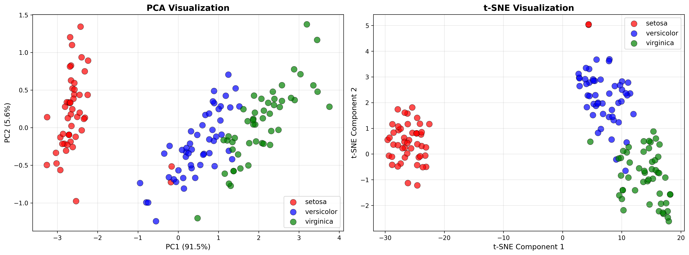
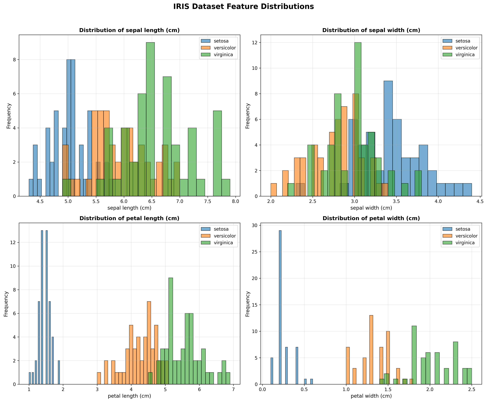
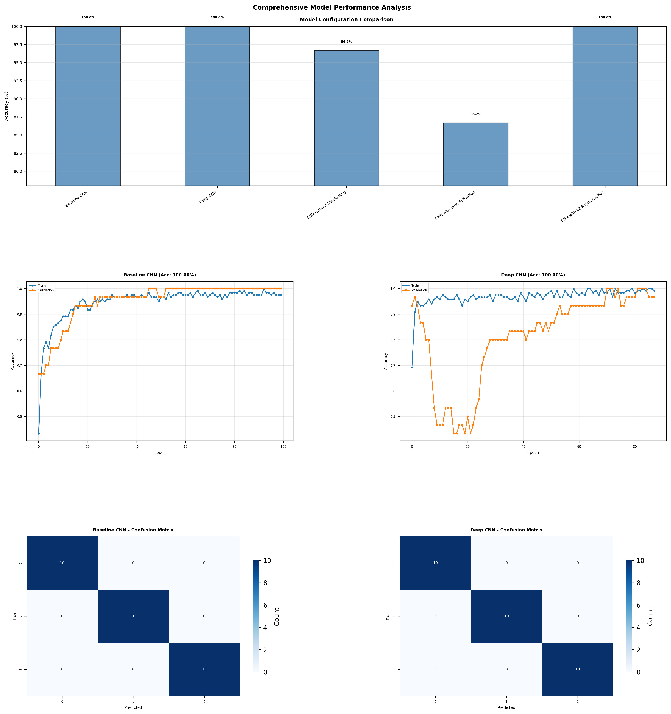
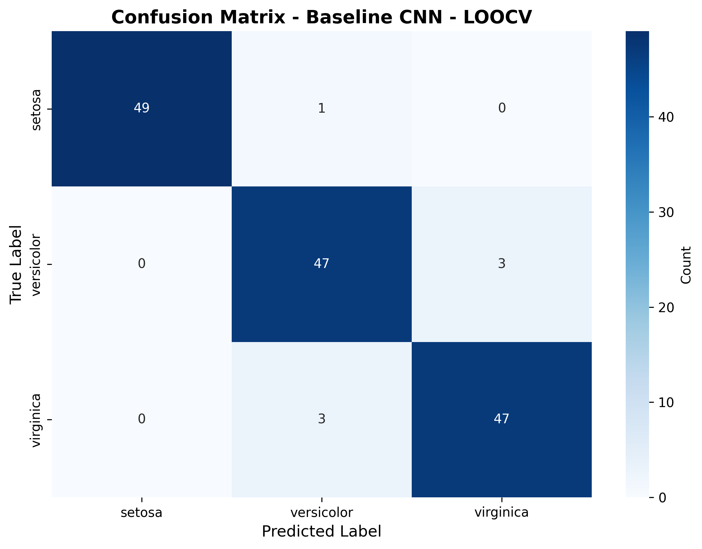
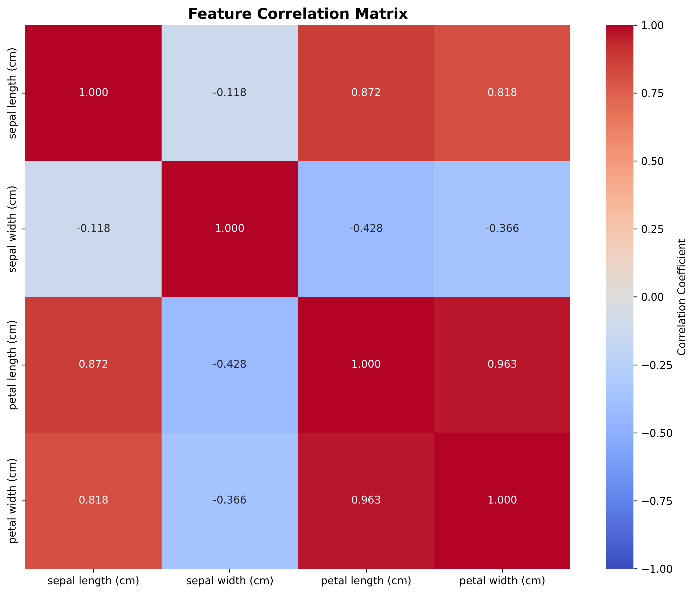

# IRIS CNN Classification

[](https://www.python.org/)
[](https://www.tensorflow.org/)
[](#license)

Classification of the IRIS dataset using **Convolutional Neural Networks (CNN)**, with hyperparameter analysis, Leave-One-Out Cross-Validation, and gradient-based feature interpretation.

> Multi-architecture CNN classification on the IRIS dataset — hyperparameter comparison, LOOCV evaluation, and gradient-based feature interpretation.

<p align="center">
  
</p>

---

## Overview

This project implements and compares **five CNN configurations** on the classic IRIS dataset (150 samples, 4 features, 3 species), analyzing the impact of hyperparameter choices and interpreting the features learned by the network. Evaluation is based on **Leave-One-Out Cross-Validation (LOOCV)** and complemented by gradient-based feature importance analysis.

### Key Findings

| Metric | Value |
|---|---|
| Test set accuracy (Baseline CNN) | **100.00%** |
| LOOCV accuracy (150 iterations) | **96.00%** |
| Most discriminative feature | Petal Width (**46.05%**) |
| Total petal contribution | **82.17%** of model decisions |

### Compared Architectures

| Configuration | Conv Layers | Activation | Key Features | Parameters |
|---|---|---|---|---|
| Baseline CNN | 1 | ReLU | MaxPooling, Dropout | 4,451 |
| Deep CNN | 3 | ReLU | BatchNorm, MaxPooling | 67,075 |
| No MaxPooling | 2 | ReLU | BatchNorm, no pooling | 91,587 |
| Tanh Activation | 2 | Tanh | BatchNorm, MaxPooling | 50,243 |
| L2 Regularization | 1 | ReLU | BatchNorm, λ=0.01 | 25,411 |

---

## Project Structure

```
DP-2026-RigonPira/
├── src/
│   ├── run_analysis.py            # Entry point — runs the full pipeline
│   ├── iris_cnn_analysis.py       # CNN models and training logic
│   ├── iris_cnn_loocv.py          # Leave-One-Out Cross-Validation
│   ├── advanced_analysis_CNN.py   # Visualization and deep analysis
│   ├── dataset_description.py     # Dataset exploration
│   └── iris_clean.py              # Data preprocessing
├── dataset/
│   └── iris.data                  # IRIS dataset (UCI ML Repository)
├── results/                       # Generated figures and reports
└── README.md
```

---

## Software Environment

| Component | Version |
|---|---|
| Python | 3.10.9 |
| TensorFlow / Keras | 2.20.0 |
| NumPy | 2.2.6 |
| Pandas | 2.3.3 |
| Scikit-learn | 1.7.2 |
| Matplotlib | 3.10.8 |
| Seaborn | 0.13.2 |

Tested on **Windows 11 (x64)**, Intel Core i5-1135G7, 16 GB RAM. **CPU-only** — no GPU required.

---

## Getting Started

### 1. Clone the repository

```bash
git clone https://github.com/RigonP/iris-cnn-classification.git
cd iris-cnn-classification
```

### 2. Create and activate a virtual environment

```bash
python -m venv venv

# Windows
venv\Scripts\activate

# macOS / Linux
source venv/bin/activate
```

### 3. Install dependencies

```bash
pip install tensorflow==2.20.0 numpy pandas scikit-learn matplotlib seaborn
```

### 4. Run the full analysis

```bash
cd src
python run_analysis.py
```

The script will:

1. Load and visualize the IRIS dataset
2. Train and compare all 5 CNN configurations
3. Run LOOCV on the best-performing model (~14 minutes on CPU)
4. Generate gradient-based feature importance and internal model visualizations
5. Save all plots and a textual report into `results/`

---

## Results Gallery

### Dataset Exploration

<p align="center">
  
</p>

The dataset is perfectly balanced (50 samples per class). *Iris setosa* is linearly separable from the other two species, while *versicolor* and *virginica* exhibit partial overlap, particularly along sepal dimensions.

### Model Comparison

<p align="center">
  
</p>

Three configurations achieved perfect test accuracy (100%); the Tanh variant underperformed at 76.67% due to the vanishing gradient problem.

### LOOCV Confusion Matrix

<p align="center">
  
</p>

All 6 misclassifications occurred at the *versicolor*–*virginica* boundary — a known taxonomic challenge — with **perfect classification** of all 50 *Iris setosa* samples.

### Feature Correlation

<p align="center">
  
</p>

Petal length and petal width show very strong correlation (**r = 0.96**), explaining their joint dominance in the model's decisions.

### Generated Files

After execution, the `results/` folder contains:

- `dataset_distribution.png` — class distribution and feature box plots
- `correlation_matrix.png` — Pearson correlation between features
- `dimensionality_reduction.png` — PCA and t-SNE 2D visualizations
- `pairwise_features.png` — pairwise feature scatter plots
- `comprehensive_comparison.png` — comparison of all 5 CNN configurations
- `confusion_matrix_loocv.png` — confusion matrix from LOOCV evaluation
- `filter_weights.png` — learned convolutional filter weights
- `misclassified_samples.png` — analysis of LOOCV misclassifications
- `analysis_report.txt` — textual summary report

---

## Methodology Highlights

- **Stratified 80/20 train-test split** preserving class distribution
- **Z-score standardization** of input features
- **Adam optimizer** (lr = 0.001) with categorical cross-entropy loss
- **Early stopping** (patience = 15) and `ReduceLROnPlateau` (factor = 0.5)
- **LOOCV** across all 150 samples for unbiased generalization estimate
- **Gradient-based feature importance** via TensorFlow `GradientTape`

---

## Dataset

Source: [UCI Machine Learning Repository — Iris](https://archive.ics.uci.edu/dataset/53/iris)

The `dataset/iris.data` file is included in this repository for direct reproducibility.

---

## License

Academic project — intended for educational and research use.

---

## Citation

If you use this work, please cite:

```bibtex
@misc{pira2026iriscnn,
  author       = {Pira, Rigon},
  title        = {IRIS Classification with Convolutional Neural Networks},
  year         = {2026},
  howpublished = {GitHub repository},
  url          = {https://github.com/RigonP/iris-cnn-classification}
}
```

This repository accompanies a written technical report by the same author covering methodology, results, and discussion in greater depth.

---

## Acknowledgments

- **TensorFlow / Keras** — for the deep learning framework used to build and train the CNN models.
- **Scikit-learn** — for the LOOCV implementation, preprocessing utilities, and evaluation metrics.
- **UCI Machine Learning Repository** — for hosting the IRIS dataset.
- **Ronald A. Fisher** (1936) — for the original publication *"The use of multiple measurements in taxonomic problems"*, which introduced the dataset that has since become a foundational benchmark in pattern recognition.

---

## Contact

**Rigon Pira** · [rp57421@ubt-uni.net](mailto:rp57421@ubt-uni.net) or [rigon.pira@ubt-uni.net](mailto:rigon.pira@ubt-uni.net)
University for Business and Technology, Prishtina, Kosovo.
